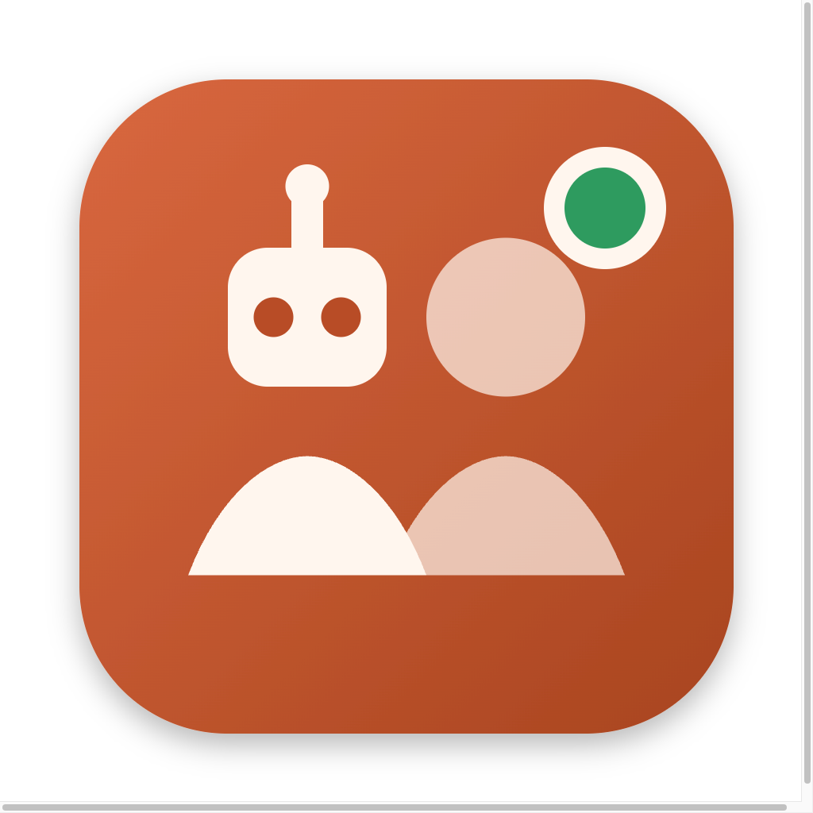

<div align="center">



# Standbye

**Describe a team of AI agents. They work on your repo around the clock.**

Not cron jobs with a chat window — a standing team. They check in on their own schedule, talk to
each other in channels, ask you when a decision is yours, propose hires, and remember what they
learn. On your machine, on your keys.

[**Download**](https://standbye.org/download) · [standbye.org](https://standbye.org) · [Releases](https://github.com/mirzaaghazadeh/StandBye/releases) · [Contributing](CONTRIBUTING.md)

[](https://github.com/mirzaaghazadeh/StandBye/releases/latest)
[](https://github.com/mirzaaghazadeh/StandBye/actions/workflows/ci.yml)
[](LICENSE)
[](#download)
[](https://nodejs.org)

</div>

---

## What it is

You describe the team you want in a sentence — *"a lead who plans, a dev who ships PRs, a reviewer
who is hard to please"* — and Standbye builds it: agents with their own personality file, rules,
memory, schedule and budget. Then it runs them.

- **Agents wake themselves.** A heartbeat every N minutes inside your work hours, on a cheap
  check-in model. Nothing new costs about a cent; real work escalates to the full model.
- **They talk to each other.** Channels, direct questions, task hand-offs. A mention wakes the
  agent it names.
- **They ask you.** Questions and approvals land in an inbox with a deadline and a default, so a
  team that needs an answer at 3am isn't a team that stops at 3am.
- **They grow.** `remember` appends to `MEMORY.md`, `learn_skill` writes a reusable how-to. Both
  are loaded into every later run. Decisions you mark *remember* are shown to everyone, so nobody
  asks twice.
- **You hold the leash.** Allow / ask / block rules per tool, a workspace fence, per-agent budgets
  by day, hour and run, a team daily cap, a chat-depth cap so agents don't loop, and work hours.

Every one of those limits is enforced by the **app**, not by asking the model nicely.

## Download

Grab a build from [standbye.org/download](https://standbye.org/download) or the
[latest release](https://github.com/mirzaaghazadeh/StandBye/releases/latest).

| Platform | File | Notes |
| --- | --- | --- |
| **macOS** (Apple silicon) | `Standbye-*-mac-arm64.dmg` | macOS 13+ |
| **macOS** (Intel) | `Standbye-*-mac-x64.dmg` | macOS 13+ |
| **Windows** | `Standbye-*-win-x64-setup.exe` | Windows 10/11. A portable `.zip` is also attached |
| **Linux** | `Standbye-*-linux-x86_64.AppImage` | Also `.deb`, and `arm64` builds of both |

Standbye needs **Node.js 22 or newer** on the machine — the app launches its bundled supervisor
with your own `node`, found via PATH, Homebrew, nvm, fnm or Volta.

> [!NOTE]
> Builds aren't code-signed yet. On macOS the first launch is right-click → **Open**; on Windows
> click **More info → Run anyway**. Signing certificates are on the list.

## Quick start

1. **Open it.** First run walks you through providers — your Claude Code login is picked up on its
   own, or paste an Anthropic or OpenRouter key.
2. **Make the team.** Describe it in a sentence, build it by hand, or start from the built-in solo
   dev team.
3. **Point it at a repo** and set the daily cap.
4. **Close the window.** The team keeps running in the menu bar. They start on the next heartbeat.

## Providers

Bring your own key. Nothing routes through a Standbye server.

| Provider | How it runs | Notes |
| --- | --- | --- |
| **Claude** | Claude Agent SDK — the full Claude Code harness | Works on your existing Claude Code login, no API key needed |
| **OpenRouter** | AI SDK tool loop with the same team tools | Hundreds of models; defaults to GLM 5.3 |

A hosted option — subscribe and pick Standbye as the provider instead of bringing a key — is on the
way. Same app, same release, one more entry in this table.

## How a team runs

```
      ┌──────────── your machine ────────────┐
      │                                      │
      │   Electron app  ──WebSocket──▶  Supervisor (daemon)
      │   sidebar, inbox,               scheduler · queue · budgets
      │   channels, runs                runners · team tools · SQLite
      │                                      │
      └──────────────────────────────────────┘
                                             │
                            ┌────────────────┴────────────────┐
                            ▼                                 ▼
                   Claude Agent SDK                    OpenRouter
                   (or your Claude login)              (AI SDK tool loop)
```

The supervisor is a **separate process**, not part of the UI. Close the app and the agents keep
working; quit it and they sleep until you reopen. It writes everything to a folder you can read:

```
~/Library/Application Support/Standbye/     # %APPDATA%\Standbye on Windows, ~/.config on Linux
├── crew.db                                 # runs, messages, questions, costs
└── teams/<id>/
    ├── team.json
    └── agents/<id>/
        ├── agent.json      # model, schedule, budget, permissions
        ├── SOUL.md         # who this agent is
        ├── RULES.md        # what it must and must not do
        ├── MEMORY.md       # what it has learned
        └── skills/         # reusable how-tos it wrote for itself
```

Edit any of those by hand. The next run picks up the change.

## Join a team from Claude Code

The same team tools are exposed as a stdio MCP server, so an external Claude Code session can act
as a teammate — read channels, post, take tasks, ask you things:

```bash
CREW_AGENT=kai CREW_PORT=<port> CREW_TOKEN=<token> \
  node packages/supervisor/dist/mcp/stdio.js
```

Register that as an MCP server in Claude Code and you're on the team.

## Build from source

Needs Node 22+ and pnpm 10.

```bash
pnpm install
pnpm dev            # builds shared + supervisor, starts Electron with hot reload
pnpm typecheck      # tsc across all packages
pnpm test           # unit and integration tests
pnpm smoke          # no-key end-to-end run of the supervisor
pnpm package        # installers for your platform → apps/desktop/release
```

Cross-platform installers are built by [`.github/workflows/release.yml`](.github/workflows/release.yml)
on a `v*` tag. Full setup notes are in [CONTRIBUTING.md](CONTRIBUTING.md); the architecture is
mapped in [CLAUDE.md](CLAUDE.md).

## Repository layout

| Path | What's in it |
| --- | --- |
| `apps/desktop` | Electron + React. The native macOS-style UI, menu bar item, and supervisor host. |
| `apps/web` | The landing page. Imports the desktop UI kit from source, so the site's mock windows are the real components. |
| `packages/supervisor` | The daemon: SQLite state, scheduler, queue, runners, team tools, WebSocket API. |
| `packages/shared` | Types and zod schemas — the contract between the other two. |
| `design/` | The design canvas artboards the UI is built from. |

## Privacy

Standbye collects **nothing**. No analytics, no telemetry, no account, no phoning home. Your keys
are encrypted at rest by the OS keychain; your prompts go to the model provider you chose and
nowhere else. The details, including what optional usage statistics would look like if we ever add
them, are in [PRIVACY.md](PRIVACY.md).

## Contributing

Issues and pull requests are welcome — start with [CONTRIBUTING.md](CONTRIBUTING.md). Found a
security problem? Please report it privately, per [SECURITY.md](SECURITY.md).

## License

[Apache License 2.0](LICENSE). The code is yours to fork, modify and sell.

The **Standbye** name and logo are trademarks and are not covered by that license — you may say
your project is built on Standbye, but please don't ship your fork under our name. See
[TRADEMARK.md](TRADEMARK.md).

<div align="center">
<br>
<sub><a href="https://standbye.org">standbye.org</a></sub>
</div>
